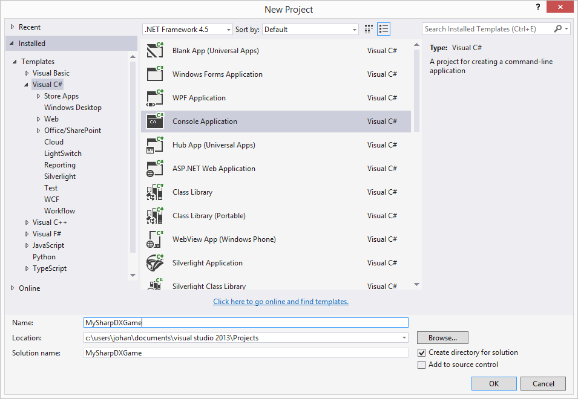
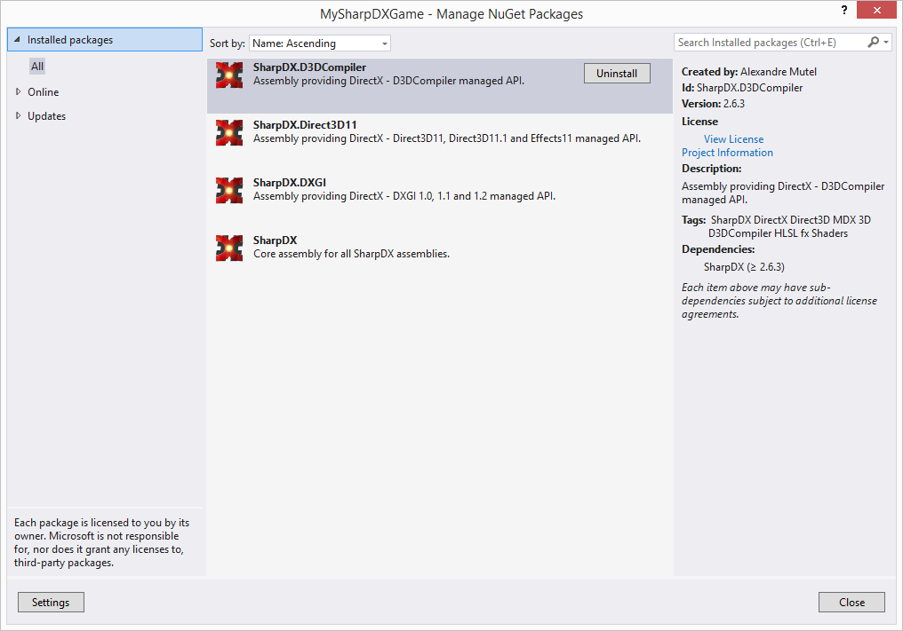

# SharpDX Beginners Tutorial Part 1: Setting up a SharpDX project in Visual Studio 2013

This is my first tutorial for using SharpDX. SharpDX allows you to render graphics using DirectX and C#. I recently started using SharpDX but there is not too much documentation and tutorials out there compared to other options, therefor I will be writing those tutorial as I go along.

Note: For those familiar with SharpDX you might know that it exists a toolkit to get a quick setup to get started, which gives a Game class similar to what is found in XNA. In those tutorials I will not be using the Toolkit.

In this tutorial we will not write any code, simply set up a new project in Visual Studio and add the required references.

1. The first step is to create a new Console Application and give it a name:
Create new project

2. Next we need to add the references to SharpDX, for which we will use NuGet. Right click on “References” in the Solution Explorer and choose “Manage NuGet Packages…”

3. Search for “SharpDX”. For now we will install those named “SharpDX”, “SharpDX.Direct3D11”, “SharpDX.DXGI”, and “SharpDX.D3DCompiler”. Now if you choose “Installed Packages” it should look like this:
NuGet packages
As you can see, there are many SharpDX packages available on NuGet, those we added are required to render a simple scene and compile our shaders.

We now have a correct project set up, in the next tutorial we will look at creating a simple window.