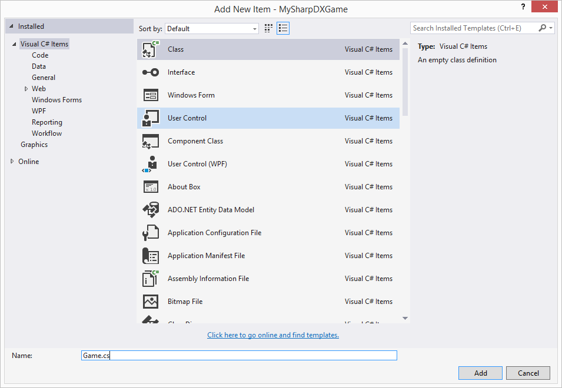
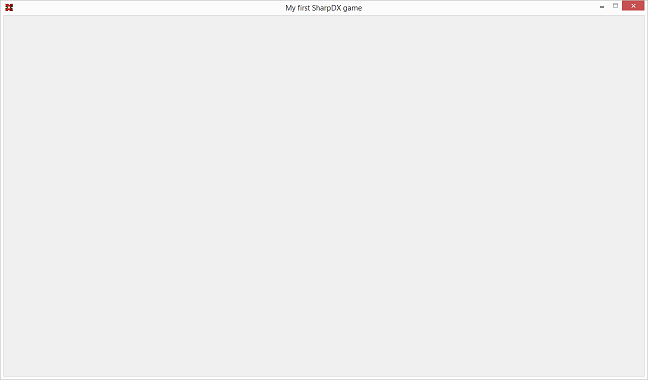

# SharpDX Beginners Tutorial Part 2: Creating a window
In this second tutorial we will look at creating a simple window which we later will render to.

1. Firstly we will create a new class called Game. Right click the project and select “Add -> Class…”, name the file `Game.cs`.

    

2. First we make the class public and then add a `RenderForm` along with two variables to hold the width and height of the window client size (the rendering size, does not include borders of the window). The `RenderForm` class also requires is to add a references to `SharpDX.Windows`.

    ```csharp
    using SharpDX.Windows;
    using System;
    using System.Collections.Generic;
    using System.Linq;
    using System.Text;
    using System.Threading.Tasks;

    namespace MySharpDXGame
    {
    public class Game
    {
        private RenderForm renderForm;

        private const int Width = 1280;
        private const int Height = 720;
    }
    }
    ```
    The `RenderForm` is a subclass to a `Windows.Form` provided by SharpDX. This class, just like `Windows.Form`, provides us with a window that has borders, title bar etc. But it also provides us with a render loop which is optimized for 3D graphics. If you want to know more about this, take a look at the SlimDX (another wrapper similar to SharpDX) documentation: http://slimdx.org/tutorials/BasicWindow.php.

3. Next we will add our constructor to the `Game` class which creates the `RenderForm`. We also need to add a reference to `System.Drawing`. We will also set a title and disable the user from resizing the window.

    ```csharp
    using System.Drawing;

    [...]

    public Game()
    {
    renderForm = new RenderForm("My first SharpDX game");
    renderForm.ClientSize = new Size(Width, Height);
    renderForm.AllowUserResizing = false;
    }
    ```
 

4. Next step is to add two methods to our `Game` class, one to start the rendering/game loop and another one which will be a callback method called each frame. This is done with the following code:

    ```csharp
    public void Run()
    {
    RenderLoop.Run(renderForm, RenderCallback);
    }

    private void RenderCallback()
    {

    }
    ```

    We pass in our `RenderForm` and method to be called each frame to the `RenderLoop.Run(…)` method.

5. We will now add a bit of clean up to our `Game` class, to make sure objects are disposed correctly. So we make our `Game` class implement the interface `IDisposable`:

    ```csharp
    public class Game : IDisposable
    {
    [...]
    
    public void Dispose()
    {
        renderForm.Dispose();
    }
    }
    ```

    Here we also make sure to dispose our `RenderForm`.

6. As a last step we will now run our game from the main method. So open the class `Program.cs`, which was automatically added when creating the “Console application project”, and change the `Main(…)` method to the following:

    ```csharp
    [STAThread]
    static void Main(string[] args)
    {
    using(Game game = new Game())
    {
        game.Run();
    }
    }
    ```

    Because `Game` implements `IDisposable` it will automatically be disposed correctly due to the using statement. Read more about how this works here: https://msdn.microsoft.com/en-us/library/yh598w02.aspx.

7. Now if you run the program you should see an empty window with the correct size and title bar text:


That was all for this tutorial, in the next part we will look at initializing the Direct3D device and set up a swap chain.