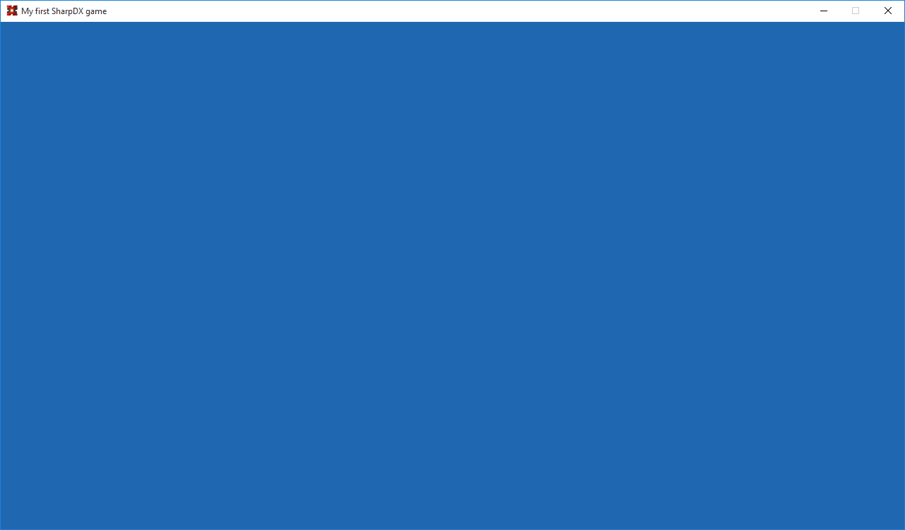

# SharpDX Beginners Tutorial Part 3: Initializing DirectX
In this part we are going to initialize DirectX.

The first step we are going to do is add a new method called `InitializeDeviceResources()` to our `Game` class, like this:

```csharp
private void InitializeDeviceResources()
{
}
```

First we will need to create a description for our back buffer, this is done with the following code:

```csharp
using SharpDX.DXGI;
[...]
ModeDescription backBufferDesc = new ModeDescription(Width, Height, new Rational(60, 1), Format.R8G8B8A8_UNorm);
```

- The first 2 parameters are the size of the back buffer, which in most cases should match the client width/height of the window we are rendering in.

- The third parameter is the refresh rate in Hz (hertz), we set this to 60/1 = 60 Hz.

- The last parameter is the format of the back buffer, here we specify a format with a red, green, blue, and alpha channel using 32-bit unsigned integer.

For a complete list see the [MSDN documentation](https://msdn.microsoft.com/en-us/library/windows/desktop/bb173064(v=vs.85).aspx) for `DXGI_MODE_DESC`.

The next step is to create a descriptor for our swap chain using the following code:

```csharp
SwapChainDescription swapChainDesc = new SwapChainDescription()
{
    ModeDescription = backBufferDesc,
    SampleDescription = new SampleDescription(1, 0),
    Usage = Usage.RenderTargetOutput,
    BufferCount = 1,
    OutputHandle = renderForm.Handle,
    IsWindowed = true
};
```

- `ModeDescription`: Here we provide our back buffer description.

- `SampleDescription`: This is a descriptor for multisampling, we just specify one level (no multisampling) See `DXGI_SAMPLE_DESC` on [MSDN](https://msdn.microsoft.com/en-us/library/windows/desktop/bb173072(v=vs.85).aspx).

- Usage: Specify if/how the CPU can access the back buffer, as we are rendering to it we specify it as `RenderTargetOutput`. For other options see [MSDN](https://msdn.microsoft.com/en-us/library/windows/desktop/bb173078(v=vs.85).aspx) for `DXGI_USAGE`.

- `OutputHandle`: Handle to the window to render in.

- `BufferCount`: Number of buffers, we just need 1.

- `IsWindowed`: Wheather we want to be in fullscreen or windowed mode.

Those are all we need to set right now, for the rest of the options, see `DXGI_SWAP_CHAIN_DESC` on [MSDN](https://msdn.microsoft.com/en-us/library/windows/desktop/bb173075(v=vs.85).aspx).

Now that we have created our descriptions it is time to create the actual device and swap chain. First we declare three private class variables in our Game class:

```csharp
using D3D11 = SharpDX.Direct3D11;
[...]
private D3D11.Device d3dDevice;
private D3D11.DeviceContext d3dDeviceContext;
private SwapChain swapChain;
```

We also added `using D3D11 = SharpDX.Direct3D11;`. We use this notation to avoid name conflicts between classes, and avoid having to write the full name, e.g. `SharpDX.Direct3D11.Device`.

Time to actually create our device and swap chain:

```csharp
using SharpDX.Direct3D;
[...]
D3D11.Device.CreateWithSwapChain(DriverType.Hardware, D3D11.DeviceCreationFlags.None, swapChainDesc, out d3dDevice, out swapChain);
d3dDeviceContext = d3dDevice.ImmediateContext;
```

- The first parameter specifies that we want to use the GPU.

- We choose to not use any special flags, for possible flags see `D3D11_CREATE_DEVICE_FLAG` on [MSDN](https://msdn.microsoft.com/en-us/library/windows/desktop/ff476107(v=vs.85).aspx).

- Third parameter is our swap chain descriptor.

- The last parameters are in which variables we want to store our swap chain and device in.

We also get our device context from the device.

Next we will create a back buffer which we can render to. First add another private class variable to hold our render target view:

```csharp
private D3D11.RenderTargetView renderTargetView;
```

We get can get this from the swap chain by specifying which type of back buffer we want, in our case a `exture2D`. Then we create a render target view from it, which we will soon use.

```csharp
using (D3D11.Texture2D backBuffer = swapChain.GetBackBuffer<D3D11.Texture2D>(0))
{
    renderTargetView = new D3D11.RenderTargetView(d3d11Device, backBuffer);
}
```

So, now we can finally render something, so why not use all of our graphic power and draw a blue screen! Let’s add a new method called `Draw()` to our Game class and add the following code:

```csharp
private void Draw()
{
    d3d11DeviceContext.OutputMerger.SetRenderTargets(renderTargetView);
    d3dDeviceContext.ClearRenderTargetView(renderTargetView, new SharpDX.Color(32, 103, 178));
    swapChain.Present(1, PresentFlags.None);
}
```

This code first sets the active render target view to the one we just created. Then it clears the render target view (currently our back buffer) and then swaps the back with the front buffer, making the back buffer visible. By specifying 1 as the first parameter to `Present(…)` we wait for vertical sync of the monitor before we present. This will limit the FPS to the update frequency of the monitor.

Now we are almost done, we need to first call `InitializeDeviceResources()` from our Game class constructor:

```csharp
public Game()
{
    [...]

    InitializeDeviceResources();
}
```

Then we also need to call `Draw()` in our `RenderCallback()` method:

```csharp
private void RenderCallback()
{
    Draw();
}
```

Finally we will add some clean-up to our `Dispose()` method:

```csharp
public void Dispose()
{
    renderTargetView.Dispose();
    swapChain.Dispose();
    d3dDevice.Dispose();
    d3dDeviceContext.Dispose();
    renderForm.Dispose();
}
```

If you run this, you should now have a nice blue window, like this:



In the next tutorial we will look at rendering our first (of many) triangle.