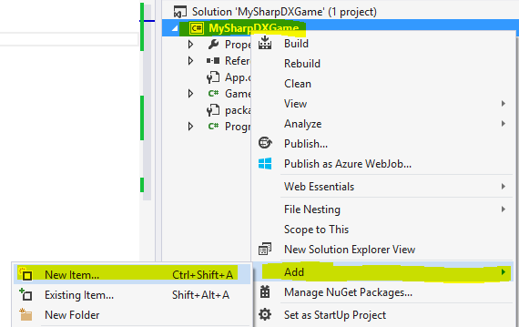
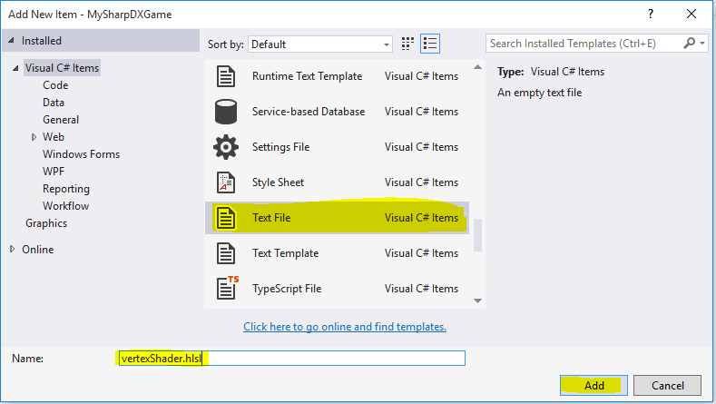
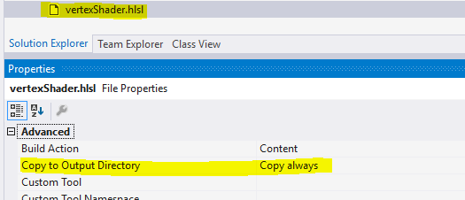
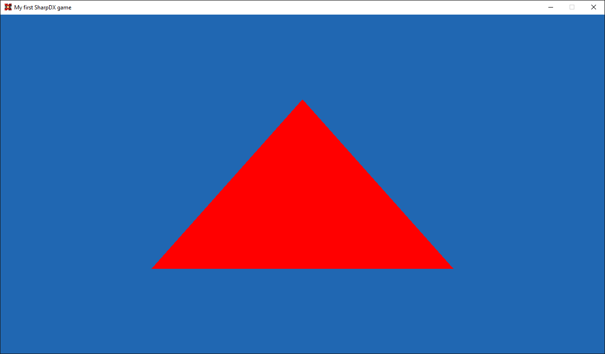

# SharpDX Beginners Tutorial Part 4: Drawing a triangle
Now that we have a window with Direct3D initialized it is finally time to draw something, and just as all other tutorials out there, we will also start with drawing a triangle! To render our first triangle there are actually quite many parts we must add, so let’s get started.

## 1. Vertices
To create the triangle, we will use vertices. A vertex is an exact point in a 3D space, which can also hold additional information (which we will see in later tutorials). For now, our vertices will only be represented by 3 values, its x, y, and z-coordinates.

For the triangle we will need 3 vertices, one for each corner. We will cover more details about the different coordinate system later, but for now our visible space is between -1 and 1 in x‑, y‑, and z‑directions. This is how I decided to set up the triangle, you can play around with the different values to see how triangle changes:


So the first code we add is a variable to our `Game` class which holds those coordinates, for this we use the `Vector3` class provided in SharpDX:

```csharp
private Vector3[] vertices = new Vector3[] { new Vector3(-0.5f, 0.5f, 0.0f), new Vector3(0.5f, 0.5f, 0.0f), new Vector3(0.0f, -0.5f, 0.0f) };
```

## 2. Vertex Buffers
The vertices array we just created is stored in the system memory, but for rendering our objects we will need to transfer the data to the video memory. For this we will use Buffers. In DirectX we have three different types of buffers, Vertex, Index, and Constant buffers. The data in buffers are automatically copied from system memory to video memory when we our rendering needs the data by DirectX.

The vertex buffer is what we will use now, this buffer type, as the name implies, holds data for each vertex. For now, our vertices only have a position vector, but later on we will add more information to each vertex. First step here is to add a new variable to our class which is a reference to our buffer:

```csharp
private D3D11.Buffer triangleVertexBuffer;
```

Then we add a new method to our class called `InitializeTriangle`, like this:

```csharp
private void InitializeTriangle()
{
   triangleVertexBuffer = D3D11.Buffer.Create<Vector3>(d3dDevice, D3D11.BindFlags.VertexBuffer, vertices);
}
```

Here the method `D3D.Buffer.Create<T>` is used to create a new buffer, the generic type parameter `T` specifies of which data type of each element in the buffer. The first argument is the Direct3D device we wish to use. The second argument is which type of buffer we want to create, in this case a vertex buffer. Lastly we provide the initial data to load into the buffer, in this case our array of positions.
Also add a call to this method at the end of the `Game` class constructor, and dispose the buffer:

```csharp
public Game()
{
   [...]
   InitializeTriangle();
} 

public void Dispose()
{
   triangleVertexBuffer.Dispose();
   [...]
}
```

## 3. Vertex and Pixel shaders
The [graphics pipeline in DirectX 11](https://msdn.microsoft.com/en-us/library/windows/desktop/ff476882(v=vs.85).aspx) consists of several programmable steps. Now we will focus on the Vertex Shader Stage and Pixel Shader Stage.

The vertex shader stage is responsible for processing vertices, this can include for example transformations (translating, rotating, scaling, etc).

The pixel shader stage processes runs for each pixel, and received interpolated per-vertex data, as well as constant variables and textures. This shader is run for each pixel of the rendered primitive, and should return the final color of the pixel.

First we add two class variables, our vertex and pixel shader:

```csharp
private D3D11.VertexShader vertexShader;
private D3D11.PixelShader pixelShader;
```

Next we need to compile our shader code (which we will write soon), which we place in a new private method, a using directive at the top is also required:

```csharp
using SharpDX.D3DCompiler;
[...]
private void InitializeShaders()
{
   using(var vertexShaderByteCode = ShaderBytecode.CompileFromFile("vertexShader.hlsl", "main", "vs_4_0", ShaderFlags.Debug))
   {
      vertexShader = new D3D11.VertexShader(d3dDevice, vertexShaderByteCode);
   }
   using(var pixelShaderByteCode = ShaderBytecode.CompileFromFile("pixelShader.hlsl", "main", "ps_4_0", ShaderFlags.Debug))
   {
      pixelShader = new D3D11.PixelShader(d3dDevice, pixelShaderByteCode);
   }
}
```

Here we first point at which files to compile, `vertexShader.hlsl` and `pixelShader.hlsl`. We also specify the name of the entry point method in the shader code, `main`. Then we also set which version of HLSL to use, in this case 4.0. Finally, we also set the compilation to debug mode.

The device context must now also be configured to use those shaders when drawing, so add this code to the end of the `InitializeShaders()` method:

```csharp
private void InitializeShaders()
{
    [...]
    // Set as current vertex and pixel shaders
    d3dDeviceContext.VertexShader.Set(vertexShader);
    d3dDeviceContext.PixelShader.Set(pixelShader);

    d3dDeviceContext.InputAssembler.PrimitiveTopology = PrimitiveTopology.TriangleList; 
}
```

Here we also set the primitive topology, this specifies how the vertices should be drawn. In this case we will use “Triangle List”, we will use other types in later tutorials, but you can check out the MSDN documentation for a good illustration of the different types.

Now, let’s add the shader code:

1. Right click on the project in the solution explorer and select Add -> New Item…


2. Find “Text File” and enter `vertexShader.hlsl` as name. Press Add.


3. Select the file in the solution explorer, and in the Properties window, set “Copy to Output Directory” to “Copy Always”.


Repeat step 1-3, but name the file `pixelShader.hlsl`.
Now open `vertexShader.hlsl` and write:

```c
float4 main(float4 position : POSITION) : SV_POSITION
{
   return position;
}
```

Here we create our entry point method `main`, as we specified earlier. To start with the method only returns the same position that it gets from the vertex buffer. Notice the `: POSITION` and `: SV_POSITION`, this is called a semantic and specifies the intended use of the variable, we will see more of why this is important later in this tutorial.

Now open the `pixelShader.hlsl` file and enter the following code:

```c
float4 main(float4 position : SV_POSITION) : SV_TARGET
{
   return float4(1.0, 0.0, 0.0, 1.0);
}
```

Again we create a main method, the parameter to the method is the output from the vertex shader. But remember that the vertex shader is run for each vertex, while pixel shader runs for each pixel, so this will be an interpolated position. From this method we return a `float4`, which is our color in the format red, green, blue, alpha. So this will produce a red color for all pixels. Worth noting is that the values in the `float4` is between `0` and `1`, so `float4(0, 0, 0, 1)` would give black, while `float4(1, 1, 1, 1)` would give a white pixel.

And of course also call our `InitializeShaders()` method in our game constructor and dispose of the shaders, this should go before the `InitializeTriangle()` method:

```csharp
public Game()
{
   [...]
   InitializeDeviceResources();
   InitializeShaders();
   InitializeTriangle();
}
public void Dispose()
{
   triangleVertexBuffer.Dispose();
   vertexShader.Dispose();
   pixelShader.Dispose();
   [...]
}
```

## 4. Input layout
We now have a vertex buffer which has our vertex data. But DirectX also wants to know about how the data is structured and of what type each vertex element has, for this we use an Input Layout. This requires two step. First we need to describe each element in a vertex, and then create an input layout from that.

As our vertices only have one element so far, the position, so let’s add a new array of InputElements in our Game class:

```csharp
private D3D11.InputElement[] inputElements = new D3D11.InputElement[] 
{
    new D3D11.InputElement("POSITION", 0, Format.R32G32B32_Float, 0)
};
```

The `POSITION` can be recognized from the shader code, this is called a semantic and is used to match with the input signature in the shader. The second parameter is which semantic slot to use, this is used if you have multiple `POSITION` semantics for example. Thirdly is the data type of this element, in this case 3 floats as the position for our vertices is Vector3.

Next we need to get the input shader from the compiled vertex shader. First create a new variable to hold the input signature to our `Game` class:

```csharp
private ShaderSignature inputSignature;
```

Then in the `InitializeShaders()` method we can get the signature from the compiled shader byte code, like this:

```csharp
using(var vertexShaderByteCode = ShaderBytecode.CompileFromFile("vertexShader.hlsl", "main", "vs_4_0", ShaderFlags.Debug))
{
    inputSignature = ShaderSignature.GetInputSignature(vertexShaderByteCode);
    [...]
}
```

Now we need to create an input layout from the array of `InputElement` and the input signature, so add another variable to the `Game` class:

```csharp
private D3D11.InputLayout inputLayout;
```

And then assign it at the end of the `InitializeShaders()` method by creating a new `InputLayout` instance. Then we set this as the current input layout on the device context.

```csharp
private void InitializeShaders()
{
    [...]
    inputLayout = new D3D11.InputLayout(d3dDevice, inputSignature, inputElements);
    d3dDeviceContext.InputAssembler.InputLayout = inputLayout;
}
```

The first element is our Direct3D device, and then our input signature from the shader and lastly the input elements array.

And don't forget to dispose the input layout and input signature:

```csharp
public void Dispose()
{
    inputLayout.Dispose();
    inputSignature.Dispose();
    [...]
}
```

## 5. Set the viewport:
Before we draw anything we have to specify the viewport. DirectX uses something called Normalized Device Coordinates, specified as (-1, -1) in upper left corner, and (1, 1) in lower right corner (and therefore (0, 0) in the middle) of the screen. The viewport maps those corners to pixel coordinates.

Firstly create another variable in our `Game` class for the Viewport:

```csharp
private Viewport viewport;
```

In the `InitializeDeviceResources()` method, create a new viewport and set it on the device context using the following code:

```csharp
// Set viewport
viewport = new Viewport(0, 0, Width, Height);
d3dDeviceContext.Rasterizer.SetViewport(viewport);
```

The first two parameters are the `x` and `y` position of `(-1, -1)` and the last two parameters are how the width and height of the viewport. As we want to use the full window we map it tell it to start in the upper left corner (0, 0) and set it to the full width and height of the window.

## 6. Drawing the vertex data
After all this work, it is finally time to draw the triangle on the screen! This is just two method calls, which we add in the middle of our `draw()` method:

```csharp
private void Draw()
{
    d3dDeviceContext.OutputMerger.SetRenderTargets(renderTargetView);
    d3dDeviceContext.ClearRenderTargetView(renderTargetView, new SharpDX.Color(32, 103, 178));
    
    d3dDeviceContext.InputAssembler.SetVertexBuffers(0, new D3D11.VertexBufferBinding(triangleVertexBuffer, Utilities.SizeOf<Vector3>(), 0));
    d3dDeviceContext.Draw(vertices.Count(), 0);
    
    swapChain.Present(1, PresentFlags.None);
}
```

The first method tells the device context to use the vertex buffer holding the triangle vertex data, with the second parameter specifying the size (in bytes) for the data of each vertex. To get this size we use a nice helper method available in SharpDX.

The `Draw()` method on the device context draws `vertices.Count()` many vertices from our vertex buffer. The second parameter specifies the offset in our vertex buffer, by settings this to 1 for example, the first vertex would be skipped.

Now when you run the program you should get the following result:

