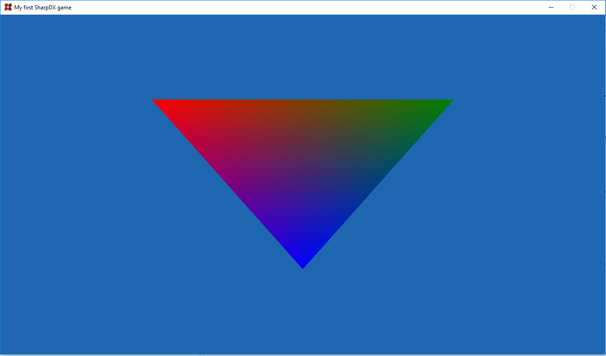
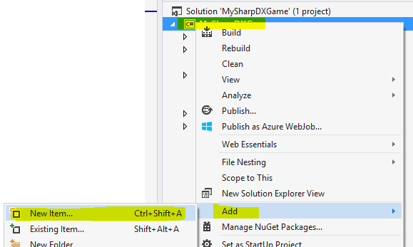
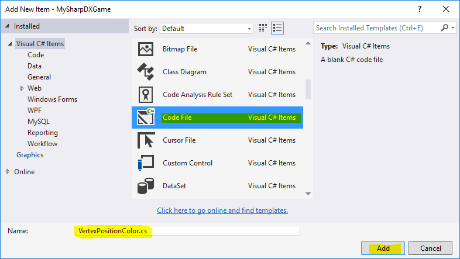

# SharpDX Beginners Tutorial Part 5: Coloring the triangle

In part 4 we created a triangle, and we could set a single color for the whole triangle in the pixel shader. In this tutorial we will see how we can add a separate color to each vertex of the triangle. We will continue working on the code from the previous tutorial, which you can also find here.

The final result will look like this:



## 1. Creating a vertex struct
Remember that when we rendered the triangle we uploaded an array of `Vector3`, because each vertex was just a position. Now we want each vertex to have both a position and a color. So we start by creating a new file called `VertexPositionColor.cs` by right clicking the project, and select `Add -> New Item...`:



Select the type “Code File”, and name it VertexPositionColor.cs, and click on Add:



Now create a struct using the following code:

```csharp
using SharpDX;
using System.Runtime.InteropServices;

namespace MySharpDXGame
{
    [StructLayoutAttribute(LayoutKind.Sequential)]
    public struct VertexPositionColor
    {
        public readonly Vector3 Position;
        public readonly Color4 Color;

        public VertexPositionColor(Vector3 position, Color4 color)
        {
            Position = position;
            Color = color;
        }
    }
}
```

So, now we have an immutable struct which has both a Position and Color. We also added the `[StructLayoutAttribute(LayoutKind.Sequential)]` attribute to the struct. This make sure that the values are laid out in memory in the same order as they are specified in the struct. This is important as we later need to tell this to the GPU.

## 2. Changing the vertices
As the next step we need to replace the array of vertices in `Game.cs` from the previous tutorial with an array of our new vertex type instead. We also choose a color for each vertex. So replace this code:

```csharp
private Vector3[] vertices = new Vector3[] { new Vector3(-0.5f, 0.5f, 0.0f), new Vector3(0.5f, 0.5f, 0.0f), new Vector3(0.0f, -0.5f, 0.0f) };
```

with this code:

```csharp
private VertexPositionColor[] vertices = new VertexPositionColor[] 
{ 
    new VertexPositionColor(new Vector3(-0.5f, 0.5f, 0.0f), SharpDX.Color.Red), 
    new VertexPositionColor(new Vector3(0.5f, 0.5f, 0.0f), SharpDX.Color.Green), 
    new VertexPositionColor(new Vector3(0.0f, -0.5f, 0.0f), SharpDX.Color.Blue) 
};
```

## 3. Updating the VertexBuffer
We will also need to change our vertex buffer to contain the new vertex struct instead of `Vector3`, so remove `<Vector3>` from the following line (in the `InitializeTriangle()` method):

```csharp
triangleVertexBuffer = D3D11.Buffer.Create<Vector3>(d3dDevice, D3D11.BindFlags.VertexBuffer, vertices);
```

Now the compiler will infer that it is a `<VertexPositionColor>` from the arguments automatically instead, so if we later change it we won’t need to change here again.

We also have to change the size of each element in the vertex buffer, so replace `Vector3` with `VertexPositionColor` the following line (in the `Draw()` method):

```csharp
d3dDeviceContext.InputAssembler.SetVertexBuffers(0, new D3D11.VertexBufferBinding(triangleVertexBuffer, Utilities.SizeOf<Vector3VertexPositionColor>(), 0));
```

## 4. Changing the input layout
As you might recall from the previous tutorial we created an input layout this describes how the vertex data is structured. In the last tutorial it looked like this:

```csharp
private D3D11.InputElement[] inputElements = new D3D11.InputElement[] 
{
    new D3D11.InputElement("POSITION", 0, Format.R32G32B32_Float, 0)
};
```

As we also added color to each vertex we need to change the input layout to the following:

```csharp
private D3D11.InputElement[] inputElements = new D3D11.InputElement[] 
{
    new D3D11.InputElement("POSITION", 0, Format.R32G32B32_Float, 0, 0, D3D11.InputClassification.PerVertexData, 0),
    new D3D11.InputElement("COLOR", 0, Format.R32G32B32A32_Float, 12, 0, D3D11.InputClassification.PerVertexData, 0)
};
```

We added another `InputElement`, where the type is a `R32G32B32A32_Float`, because the `SharpDX.Color4` struct we used in our vertex struct contains 4 floats (in RGBA order). We also add a few other arguments, most are irrelevant right now, except the 4th, where we specify `0` for `POSITION`, but `12` for the `COLOR` element. This argument is the offset in the structs where this data starts (in bytes), and because the position comes first it has offset 0, and each position is a `Vector3` which contains 3 floats (x, y, z) of 4 bytes each = 12 bytes. So therefore the color data will be found after 12 bytes.

## 5. Updating the vertex shader
Open up the `vertexShader.hlsl` file. Firstly, we are going to change the main function parameter list to also include the color:

```c
float4 main(float4 position : POSITION, float4 color : COLOR) : SV_POSITION
{
   [...]
}
```

As you can see the vertex shader now takes in the color as well, but because the color is set in the pixel shader we also need to return the color from this function. To return multiple values from the function we need to create a struct which contains both the position and color at the top of the shader file:

```c
struct VSOut
{
    float4 position : SV_POSITION;
    float4 color : COLOR;
};
```

Now we change the function return value to this struct instead, and remove the `SV_POSITION` semantic:

```c
VSOut main(float4 position : POSITION, float4 color : COLOR)
{
    […]
}
```

And instead of just returning the position from the shader we are going to create a `VSOut` struct and set the position and color values in that instead. So the final vertex shader should look like this:

```c
struct VSOut
{
    float4 position : SV_POSITION;
    float4 color : COLOR;
};

VSOut main(float4 position : POSITION, float4 color : COLOR)
{
    VSOut output;
    output.position = position;
    output.color = color;

    return output;
}
```

## 6. Updating the pixel shader
In the pixel shader (`pixelShader.hlsl`), we need to add the color as a function parameter, and then instead of returning a red color we return the provided color, so the full pixel shader should look like this:

```c
float4 main(float4 position : SV_POSITION, float4 color : COLOR) : SV_TARGET
{
    return color;
}
```

## 7. The final result
We are now done, and if you run the project you should now get the following result:

